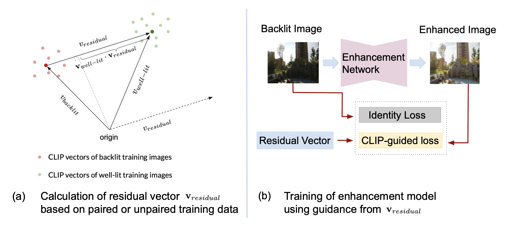

## RAVE: Residual Vector Embedding for CLIP-Guided Backlit Image Enhancement

<div>
    <strong>Accepted to ECCV 2024</strong> • <a href="" target='_blank'>Project Page</a> • <a href="https://arxiv.org/abs/2404.01889" target='_blank'>arXiv</a> 
    <br>
</div>
<p></p>
<div> <strong>Authors</strong>:
    <a href='https://atmyre.github.io' target='_blank'>Tatiana Gaintseva</a>&emsp;
    <a href='https://profiles.ucl.ac.uk/95169-martin-benning' target='_blank'>Martin Benning</a>&emsp;
    <a href='https://www.qmul.ac.uk/eecs/people/profiles/slabaughgreg.html' target='_blank'>Gregory Slabaugh</a>
    <br>
</div>
<p></p>


In this paper we propose a <strong>novel modification of CLIP guidance for the task of unsupervised backlit image enhancement</strong>. Our work builds on the state-of-the-art [CLIP-LIT](https://zhexinliang.github.io/CLIP_LIT_page/) approach, which learns a prompt pair by constraining the text-image similarity between a prompt (negative/positive sample) and a corresponding image (backlit image/well-lit image) in the CLIP embedding space. Learned prompts then guide an image enhancement network. Based on the CLIP-LIT framework, <strong>we propose two novel methods for CLIP guidance</strong>. First, we show that instead of tuning prompts in the space of text embeddings, it is possible to directly tune their embeddings in the latent space without any loss in quality. This accelerates training and potentially enables the use of additional encoders that do not have a text encoder. Second, <strong>we propose a novel approach that does not require any prompt tuning</strong>. Instead, based on CLIP embeddings of backlit and well-lit images from training data, we compute the residual vector in the embedding space as a simple difference between the mean embeddings of the well-lit and backlit images. This vector then guides the enhancement network during training, pushing a backlit image towards the space of well-lit images. This approach further dramatically reduces training time, stabilizes training and produces high quality enhanced images without artifacts, both in supervised and unsupervised training regimes. Additionally, we show that <strong>residual vectors can be interpreted</strong>, revealing biases in training data, and thereby enabling potential bias correction. 


## :bookmark: Approach
<div align="center">

</div>
In RAVE <strong>we exploit arithmetic defined in the CLIP latent space</strong>. Using well-lit and backlit training data, we construct a residual vector, which will then be used for enhancement model guidance. This is a vector that points in a direction moving from backlit images to well-lit images in the CLIP embedding space. We then use this vector as guidance for the image enhancement model during training. This will train the image enhancement model to produce images with CLIP latent vectors that are close to the CLIP latent vectors of well-lit training images. 

## :bookmark: Updates
- **2024.08.26**: Code for training and testing as well as model checkpoints are publicly available now.


## :bookmark: Usage

### :heavy_check_mark: Training and Testing Data:
Training and testing data can be downloaded from:
- [BAID dataset (train and test parts)](https://drive.google.com/drive/folders/14_OvT17bfoN-JEH0GTFD6bnKzjKmag_l?usp=sharing);
- [DIV2K images](https://drive.google.com/drive/folders/1PbWzGzxLF0OJMyA7zMj_Dd00UB_ulhb4?usp=sharing) (well-lit images used instead of well-lit images from BAID for training models in unpaired setting);
- [LOL-v1 dataset](https://drive.google.com/drive/folders/1ewmaFEVjKmzS8fLisSA7q_t1RbBdz6He?usp=sharing) for low-light image enhancement task (see supplementary material of RAVE paper for results on this data).


### :heavy_check_mark: Run Training:

#### :heavy_minus_sign: CLIP-LIT

Train from scratch:

```
python train.py \
 -b path_to_backlit_train_images  \
 -r path_to_well_lit_train_images \
 --mode clip-lit                  \
 --exp_name clip_lit              \
 --train_lr 0.00002               \
 --prompt_lr 0.000005             \
 --num_reconstruction_iters 1000  \
 --num_clip_pretrained_iters 8000 \
 --load_pretrain_unet False       \
 --load_pretrain_guidance False   \
 ```

If you have pre-trained Unet and/or guidance model checkpoints, you can resume training as follows:

```
 python train.py \
 -b path_to_backlit_train_images  \
 -r path_to_well_lit_train_images \
 --mode clip-lit                  \
 --exp_name clip_lit              \
 --train_lr 0.00002               \
 --prompt_lr 0.000005             \
 --num_reconstruction_iters 0     \ # if you have UNet ckpt, change this to 0
 --num_clip_pretrained_iters 0    \ # if you have guidance model ckpt, change this to 0
 --load_pretrain_unet True        \
 --unet_pretrain_dir path_to_unet_ckpt \
 --load_pretrain_guidance True    \
 --guidance_pretrain_dir path_to_guidance_model_ckpt \
 ```

 #### :heavy_minus_sign: CLIP-LIT-Latent

Train from scratch:

```
python train.py \
 -b path_to_backlit_train_images  \
 -r path_to_well_lit_train_images \
 --mode clip-lit-latent           \
 --exp_name clip_lit-latent       \
 --train_lr 0.00002               \
 --prompt_lr 0.0005               \
 --num_reconstruction_iters 1000  \
 --num_clip_pretrained_iters 8000 \
 --load_pretrain_unet False       \
 --load_pretrain_guidance False   \
 ```

If you have pre-trained Unet and/or guidance model checkpoints, you can resume training as follows:

```
 python train.py \
 -b path_to_backlit_train_images  \
 -r path_to_well_lit_train_images \
 --mode clip-lit-latent           \
 --exp_name clip_lit              \
 --train_lr 0.00002               \
 --prompt_lr 0.0005               \
 --num_reconstruction_iters 0     \ # if you have UNet ckpt, change this to 0
 --num_clip_pretrained_iters 0    \ # if you have guidance model ckpt, change this to 0
 --load_pretrain_unet True        \
 --unet_pretrain_dir path_to_unet_ckpt \
 --load_pretrain_guidance True    \
 --guidance_pretrain_dir path_to_guidance_model_ckpt \
 ```


 #### :heavy_minus_sign: RAVE

Train from scratch without shifting the residual vector:

```
python train_rave.py \
 -b path_to_backlit_train_images  \
 -r path_to_well_lit_train_images \
 --exp_name rave                  \
 --train_lr 0.00002               \
 --num_reconstruction_iters 1000  \
 --load_pretrain_unet False       \
 ```

To train RAVE with shifted residual by n tokens add the following instruction:
 ```
 --remove_first_n_tokens n         \
 ```


If you have pre-trained Unet, you can resume training as follows:

```
python train_rave.py \
 -b path_to_backlit_train_images  \
 -r path_to_well_lit_train_images \
 --exp_name rave                  \
 --train_lr 0.00002               \
 --num_reconstruction_iters 1000  \
 --load_pretrain_unet False       \
 --unet_pretrain_dir path_to_unet_ckpt \
 ```


### :heavy_check_mark: Inferencing and Testing:

#### :heavy_minus_sign: Pretrained checkpoints

Pretrained checkpoints for all the models are stored in 'pretrained_models' dir.

Models trained on paired data:
- <strong>CLIP-LIT</strong>: clip_lit_paired.pth;
- <strong>CLIP-LIT-Latent</strong>: clip_lit_latent_paired.pth;
- <strong>RAVE</strong>: rave_paired.pth.

Models trained on unpaired data:
- <strong>CLIP-LIT</strong>: clip_lit_unpaired.pth;
- <strong>CLIP-LIT-Latent</strong>: clip_lit_latent_unpaired.pth;
- <strong>RAVE without shifting the residual</strong>: rave_unpaired.pth;
- <strong>RAVE with shifting the residual by 15 tokens</strong>: rave_unpaired_shifted.pth.

#### :heavy_minus_sign: Inferencing
To run trained model on backlit images use the following command:

```
python inference.py \
 --input path_to_input_images \
 --output path_to_output_dir  \
 --unet_pretrain_dir path_to_pretrained_ckpt
```

#### :heavy_minus_sign: Testing (computing metrics)

To compute metrics (SSIM, PSNR, LPIPS, FID) on bunch of backlit and corresponding enhanced images, use the following command:

```
python compute_metrics.py \
 --gt_images_path path_to_ground_truth_well_lit_images \
 --enhanced_images_path path_to_ground_enhanced_images  
```

## :bookmark: Citation
If you find our work useful, please consider citing the paper:
```
@misc{gaintseva2024raveresidualvectorembedding,
      title={RAVE: Residual Vector Embedding for CLIP-Guided Backlit Image Enhancement}, 
      author={Tatiana Gaintseva and Martin Benning and Gregory Slabaugh},
      year={2024},
      eprint={2404.01889},
      archivePrefix={arXiv},
      primaryClass={cs.CV},
      url={https://arxiv.org/abs/2404.01889}, 
}
```

## :bookmark: Contacts
Please feel free to reach out at `t.gaintseva@qmul.ac.uk`. 
